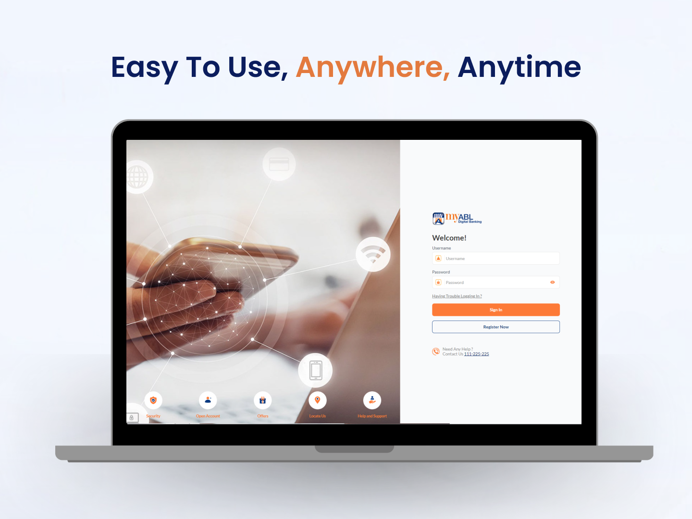
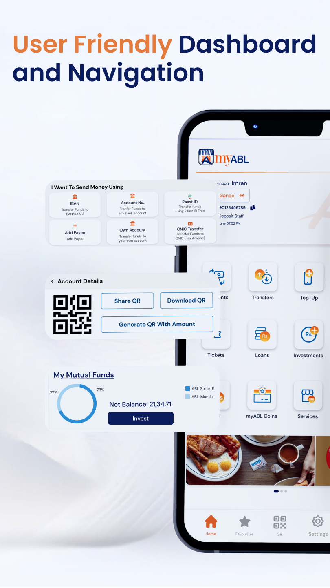
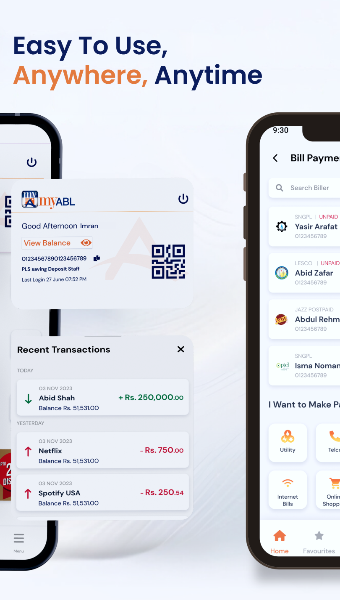
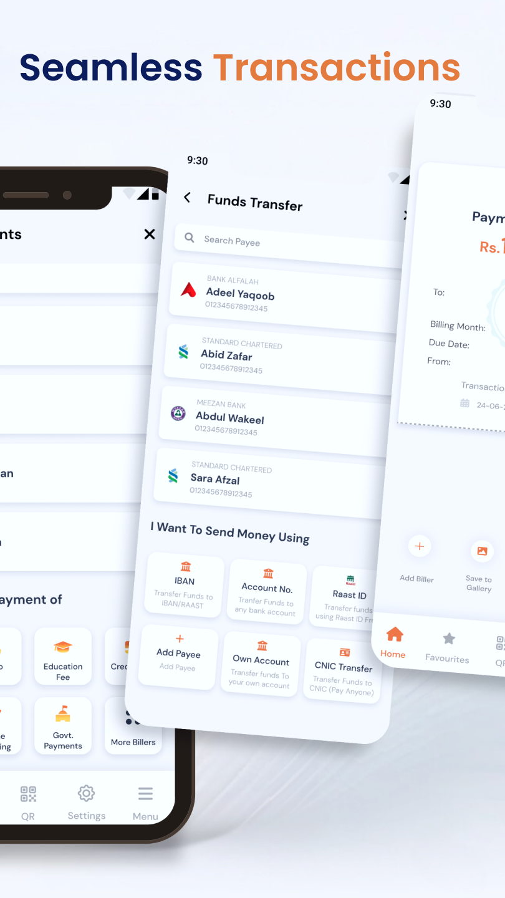
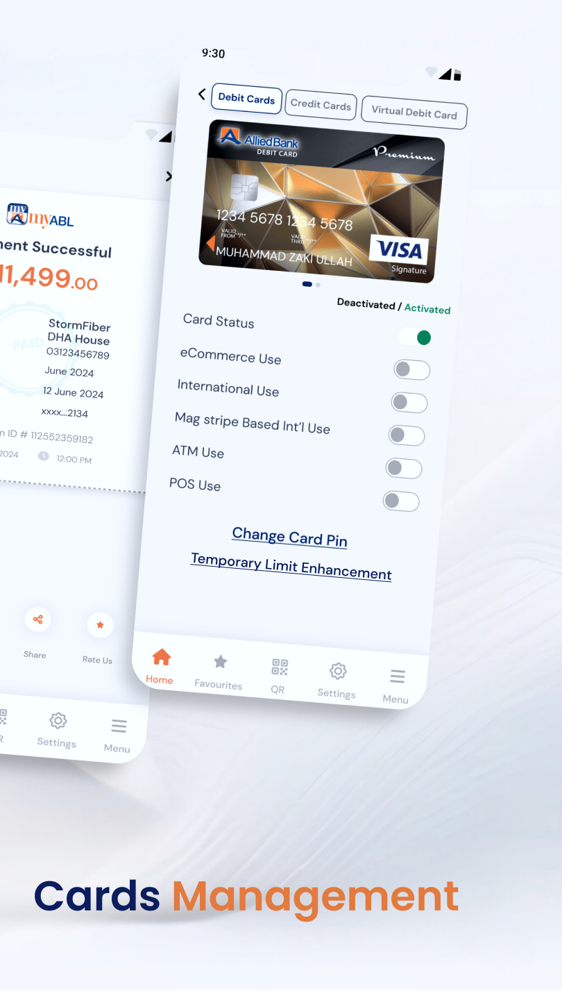
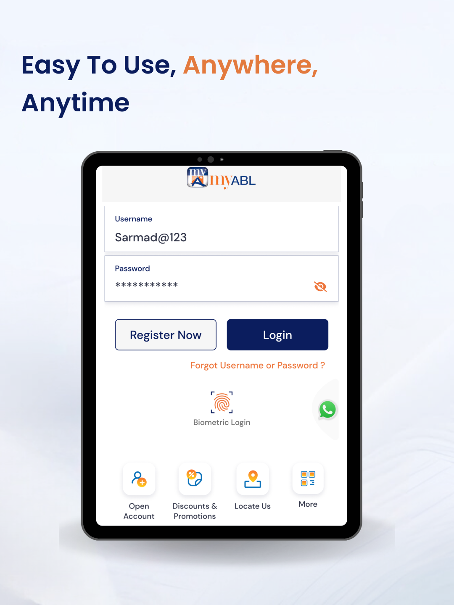

# my-abl-mobile-app
High Level Case Study of my abl Mobile app which is used by million of users 
# 🏦 MyABL Mobile Banking App — Case Study

<p align="center">
  
</p>

---

### 🌍 Overview

**MyABL Mobile App** is the official **Allied Bank Limited (ABL)** mobile banking solution, used by **millions of users across Pakistan** for secure, convenient digital banking.  
This app empowers customers to manage accounts, transfer funds, pay bills, and access financial services with an intuitive, modern user experience.

This repository serves as a **public case study and documentation** of the project’s technical architecture, development process, and design approach.  
> ⚠️ **Note:** No proprietary source code, credentials, or client data are included — this is a conceptual and educational showcase.

---

### 📱 Live Versions

| Platform | Link |
|-----------|------|
| **Android** | [MyABL Mobile App (Google Play)](https://play.google.com/store/apps/details?id=com.ofss.digx.mobile.android.allied&hl=en) |
| **iOS** | [MyABL Mobile App (App Store)](https://apps.apple.com/bj/app/myabl/id1259150427) |

---

### 💡 About the App

**MyABL Mobile** enables Allied Bank customers to:
- View account balances and transaction history  
- Perform **fund transfers** (intrabank, interbank, and international)  
- Pay **utility bills**, education fees, and mobile top-ups  
- Manage **debit and credit cards**  
- Locate nearby **branches and ATMs**  
- Receive **real-time notifications**  
- Login securely using **biometrics and OTPs**  

The app is designed for reliability, performance, and compliance with **banking-grade security standards**.

---

### 👨‍💻 My Role — Mobile Developer (React Native / .NET Integration)

As one of the **core developers** on this high-impact digital banking solution, I was responsible for building and optimizing major modules of the mobile application using **React Native** and collaborating closely with the **.NET backend team**.

#### 🔹 Responsibilities & Achievements

**1. Mobile Architecture & Feature Development**
- Developed reusable and responsive UI components across Android and iOS using React Native.  
- Architected **modular feature layers** (login, account overview, transfers, bill payments).  
- Implemented **Redux state management** to maintain predictable and scalable data flows.

**2. Backend Integration**
- Collaborated with backend engineers on **.NET Web API design** for core banking features.  
- Integrated secure REST APIs using **Axios** with interceptors for token refresh and error handling.  
- Implemented **offline caching** and data synchronization strategies for low-connectivity users.

**3. Security & Performance**
- Implemented **biometric authentication**, **SSL pinning**, and **encrypted storage** for sensitive data.  
- Conducted **performance optimization**, reducing app launch time and improving rendering performance.  
- Integrated **Firebase Crashlytics** and **AppCenter Analytics** for monitoring and performance tracking.

**4. CI/CD & Collaboration**
- Set up **Fastlane + GitHub Actions** for automated builds and distribution.  
- Participated in **peer code reviews** to maintain high code quality.  
- Worked with **QA and UX teams** to ensure accessibility and usability across devices.

**5. UX & Accessibility**
- Designed adaptive UI components to support small and large screen sizes.  
- Enhanced app accessibility for visually impaired users through screen reader and font scaling support.

---
---

### 🖼️ Screenshots

> Screenshots are mockups and non-confidential images representing the app’s UI.

| Login / Onboarding | Dashboard | Transactions |
|-------------------|-----------|--------------|
| |  |  |

| Fund Transfers | Bill Payments |
|----------------|---------------|
|  |  |


### 🧩 Tech Stack

| Category | Technology |
|-----------|-------------|
| **Frontend (Mobile)** | React Native (JavaScript / TypeScript) |
| **Backend Services** | .NET Framework / ASP.NET Web API |
| **State Management** | Redux / Context API |
| **Networking** | Axios (React Native) |
| **Authentication** | OAuth 2.0 / JWT / ABL Secure Token Service |
| **Security** | SSL Pinning, AES Encryption, Biometric Authentication |
| **Crash & Analytics** | Firebase Crashlytics, AppCenter, Firebase Analytics |
| **CI/CD** | GitHub Actions, Fastlane |
| **Development Tools** | Visual Studio, VS Code, Postman, Charles Proxy |

---

### 🏗️ Architecture Overview

The **MyABL** mobile architecture follows a modular, layered approach for scalability and maintainability.

```plaintext
React Native (Cross-Platform)
│
├── UI Layer (React Components)
│     ├── Login, Dashboard, Transfers, Payments
│
├── State Management (Redux)
│     ├── Reducers, Actions, Middleware
│
├── Service Layer (Network, Auth, API Handlers)
│     ├── Axios Interceptors, Secure Storage, Error Handling
│
├── .NET Backend (REST APIs)
│     ├── Business Logic, Authentication, Data Services
│
└── Database Layer (SQL Server)
      ├── Encrypted Data & Transaction Records
